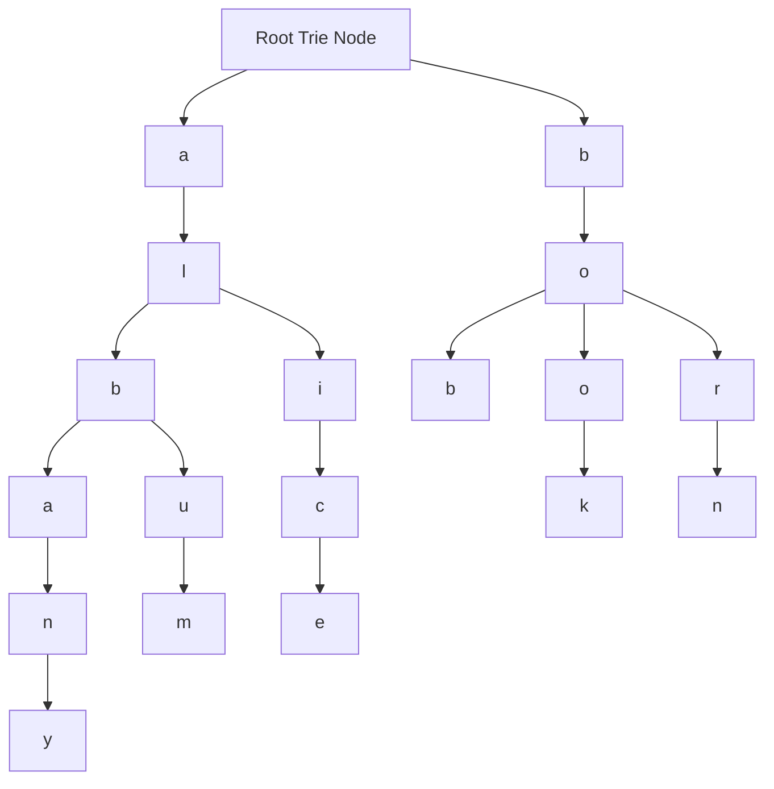

# Trie Structure in TypeScript

> This repository is purely for reference and is illustrative in it is purpose. This is one of the many ways of implementing this algorithm, but represents a vanilla implementation without any additional packages.

This project illustrates an implementation of a Trie or Prefix-Tree structure [Trie](https://en.wikipedia.org/wiki/Trie) in TypeScript with implementations of inserting, searching, suggestions, and deleting.

A **Trie** (pronounced "try") is a tree-like data structure used to efficiently store and search for words or sequences, especially when working with prefixes. Each node represents a character, and paths through the tree spell out words. For example, in a Trie storing "cat," "car," and "cart," the first three nodes would share the common prefix "ca." Tries are great for autocomplete, dictionary storage, and prefix-based searching because they allow quick lookups by following the path of characters.

## Trie Examples

* **Dictionary Storage**: A Trie can store words like "apple," "apply," and "apt," efficiently organizing them by their common prefixes.
* **Phone Directory**: A Trie can store contacts like "John," "Johnny," and "Joanna," enabling fast lookups starting with "Jo."
* **IP Routing**: In network systems, a Trie can store and search IP address prefixes for routing decisions.

## Prerequisites

Before you continue, ensure you have met the following requirements:

* NodeJS v20 or higher installed
* Npm installed

## Running the Application

1) Repeat steps 4 through 6 opening a new terminal for each of the below commands (issued at the root of this repository)
    * **npm run ema-subscription**
    * **npm run sma-subscription**
    * **npm run overview-subscription**

## Notes
* This repository is heavily commented to provide context as to what and why, if in VS Code feel free to collapse all comments if they are obtrusive
    * On Mac -> Press <kbd>&#8984;</kbd> + <kbd>K</kbd> then <kbd>&#8984;</kbd> + <kbd>/</kbd> 
    * On Windows & Linux -> Press <kbd>Ctrl</kbd> + <kbd>K</kbd> then <kbd>Ctrl</kbd> + <kbd>/</kbd> 

